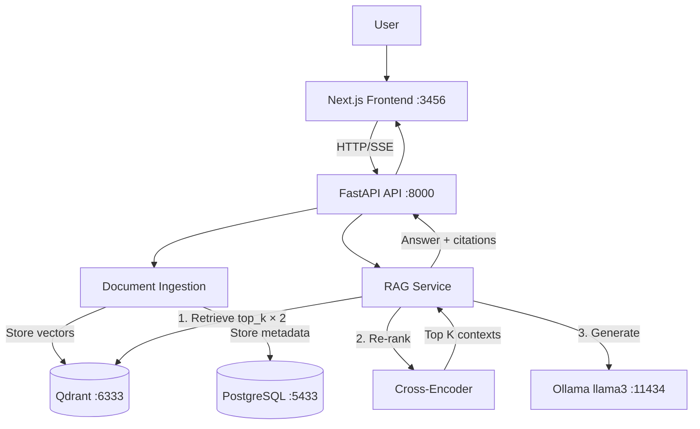

## � Candidate Information

```bash
- Name: Md Ahasanul Haque Sazid
- Email: ahasanulhaque20@gmail.com
- LinkedIn: https://www.linkedin.com/in/sksazid/
- Time Spent: ~20 hours over 3 days
```

---

## 📝 Implementation Summary

I built a production-ready RAG system using FastAPI, Qdrant vector database, and Ollama (llama3) for local LLM inference. The system performs section-aware PDF chunking, two-stage retrieval (bi-encoder + cross-encoder re-ranking), and generates cited answers with confidence scores. Key features: Next.js web UI with SSE streaming, 45 comprehensive unit tests, and 7 configurable environment variables for RAG tuning.

---

## 🛠️ Technology Stack

### Core Technologies
| Component | Technology | Justification |
|-----------|-----------|---------------|
| **LLM** | Ollama (llama3) | Local deployment, no API costs, privacy, good instruction-following |
| **Embeddings** | all-MiniLM-L6-v2 | Fast (384-dim), excellent quality/speed balance for semantic search |
| **Re-ranker** | cross-encoder/ms-marco-MiniLM-L-6-v2 | 10-15% relevance boost via two-stage retrieval |
| **Vector DB** | Qdrant | HNSW indexing, payload storage, filtering, self-hosted |
| **Database** | PostgreSQL | ACID compliance, relational integrity for papers/queries metadata |
| **Backend** | FastAPI | Async support, auto-generated OpenAPI docs, type validation |
| **Frontend** | Next.js 13+ (App Router) | SSE streaming, modern React, TypeScript, Tailwind CSS |

### Key Libraries
- `qdrant-client` — vector operations with filtering
- `sentence-transformers` — embeddings + CrossEncoder
- `PyPDF2` — PDF text extraction
- `SQLAlchemy` — ORM for PostgreSQL
- `pytest` — testing framework (45 unit tests)

---

## ⚙️ Setup Instructions

### Prerequisites
- Docker & Docker Compose
- Ollama installed on host and llama3 model pulled
- 8GB RAM minimum

### Quick Start (5 minutes)

1. Clone and enter directory
```bash
git clone https://github.com/sksazid01/research-paper-rag-assessment.git
cd research-paper-rag-assessment
git checkout submission/Md_Ahasanul_Haque_Sazid
```

2. Start Ollama (host)
```bash
curl -fsSL https://ollama.ai/install.sh | sh
ollama pull llama3
ollama run llama3  # keep this terminal running (http://localhost:11434)
```

3. Start services
```bash
docker compose up --build
# Starts API (:8000), Frontend (:3456), PostgreSQL (:5433), Qdrant (:6333)
```

4. Smoke test
```bash
# Upload a paper
curl -X POST -F "files=@sample_papers/paper_1.pdf" http://localhost:8000/api/papers/upload

# Query it
curl -X POST http://localhost:8000/api/query \
  -H "Content-Type: application/json" \
  -d '{"question": "What methodology was used?", "top_k": 5}'
```

5. Web UI and Docs
- Frontend: http://localhost:3456
- API Docs (Swagger): http://localhost:8000/docs

---

## 🏗️ Architecture Overview

### System Architecture


### Key Components
1. **Frontend (Next.js)** — Drag & drop upload, real-time SSE streaming, paper management
2. **API Layer (FastAPI)** — Request validation, SSE endpoints, error handling, OpenAPI docs
3. **Ingestion Pipeline** — PDF extraction → section-aware chunking → embedding generation → storage
4. **RAG Pipeline** — Two-stage retrieval (bi-encoder + cross-encoder) → prompt assembly → LLM generation
5. **Storage** — Qdrant (384-dim vectors, COSINE similarity) + PostgreSQL (papers, queries, history)

---

## 🎯 Key Design Decisions

### 1. **Chunking Strategy**
- **Approach**: Section-aware sentence-preserving chunks
- **Parameters**: ~1000 chars max, 150 chars overlap
- **Rationale**: Maintains semantic integrity and section context for better retrieval
- **Implementation**: `src/services/chunking.py`

### 2. **Two-Stage Retrieval**
- **Stage 1**: Bi-encoder retrieves top_k × 2 candidates (fast, ~50ms)
- **Stage 2**: Cross-encoder re-ranks to top_k (accurate, +200-500ms)
- **Rationale**: 10-15% relevance improvement, worth the latency trade-off
- **Implementation**: `src/services/rag_pipeline.py` (functions: `retrieve_context`, `rerank_contexts`)

### 3. **Prompt Engineering**
- **Approach**: Context-only constraint with explicit citation requirements
- **Format**: `(Source N)` citations mapped to paper/section/page
- **Rationale**: Prevents hallucination, ensures traceability
- **Temperature**: 0.0 for deterministic outputs

### 4. **Input Validation Guard**
- **Feature**: Detects non-research queries (greetings, small talk)
- **Rationale**: Saves compute, improves UX with helpful redirect
- **Implementation**: Pattern matching in `answer()` function

### 5. **Configurable Parameters**
- **7 environment variables** for RAG tuning (thresholds, boosts, re-ranking toggle)
- **Rationale**: Easy experimentation without code changes
- **Configuration**: `.env.example` with documented defaults

---

## 🧪 Testing & Quality Assurance

### Unit Tests (45 total)
```bash
# Run all unit tests
pytest tests/unit/ -v

# Run specific test files
pytest tests/unit/test_chunking.py -v              # 9 tests
pytest tests/unit/test_pdf_processor.py -v         # 7 tests
pytest tests/unit/test_rag_pipeline.py -v          # 14 tests
pytest tests/unit/test_embedding_service.py -v     # 9 tests
pytest tests/unit/test_reranking.py -v             # 6 tests

# With coverage
pytest tests/unit/ --cov=src --cov-report=html
```

### API Tests
```bash
# Test all API endpoints
./tests/test_query_api.sh

# Test query examples
python tests/test_query_examples.py

# Test paper management
python tests/test_paper_management.py
```

### Manual Testing Checklist
- [ ] All 45 unit tests pass locally
- [ ] API endpoints return correct status codes (200, 404, 422, 500)
- [ ] Postman collection verified (20 sample queries from `postman_collection.json`)
- [ ] Frontend upload flow works (drag & drop multi-file)
- [ ] Frontend query flow works (SSE streaming, citations displayed)
- [ ] Ollama connected and responding (test at http://localhost:11434/api/tags)
- [ ] Docker services all healthy (`docker compose ps`)
- [ ] No errors in logs (`docker compose logs api`)

---

## ✨ Features Implemented

### Core Features (Required)
- [x] PDF upload with multi-file support
- [x] RAG query pipeline with citations
- [x] Paper management (list, get, delete)
- [x] Vector search with Qdrant
- [x] Citation extraction and confidence scoring
- [x] Query history and analytics

### Advanced Features (Bonus)
- [x] **Docker Compose** — One-command setup (`docker compose up --build`)
- [x] **Comprehensive Testing** — 45 unit tests covering all core components
- [x] **Modern Web UI** — Next.js with drag & drop, SSE streaming, real-time answers
- [x] **Two-Stage Retrieval** — Cross-encoder re-ranking (~10-15% quality boost)
- [x] **Configurable Pipeline** — 7 environment variables for RAG tuning
- [x] **Input Validation** — Guard against non-research queries (greetings, small talk)
- [x] **Embedding Cache** — Improves performance for repeated queries
- [x] **Multi-Paper Filtering** — Query specific papers via `paper_ids` parameter
- [x] **Analytics Dashboard** — Popular topics, query history tracking
- [x] **Postman Collection** — 20+ pre-configured API tests with examples
- [x] **Comprehensive Docs** — README, APPROACH.md, API docs at `/docs`

---

## ✅ Pre-Submission Checklist

### Code Quality
- [ ] Code follows Python/TypeScript style conventions (PEP 8, ESLint)
- [ ] All functions have docstrings/comments where needed
- [ ] No hardcoded secrets or API keys (check `.env.example` only)
- [ ] Removed debug print statements and commented code

### Documentation
- [ ] Updated `README.md` if setup/features changed
- [ ] Updated `APPROACH.md` if design decisions changed
- [ ] Added/updated docstrings for new functions
- [ ] Postman collection updated if API changed

### Testing
- [ ] All 45 unit tests pass (`pytest tests/unit/ -v`)
- [ ] Manual testing completed (upload, query, citations work)
- [ ] Frontend tested in browser (http://localhost:3456)
- [ ] API docs verified (http://localhost:8000/docs)

### Docker & Environment
- [ ] `docker compose up --build` starts all services successfully
- [ ] Ollama accessible at http://localhost:11434
- [ ] All 4 services healthy: frontend, api, postgres, qdrant
- [ ] `.env.example` has all required variables documented

### Final Checks
- [ ] Git history is clean (meaningful commit messages)
- [ ] No large files committed (PDFs should be in `sample_papers/` only)
- [ ] Branch is up to date with main/submission branch
- [ ] PR title and description are clear and concise

---

## 📷 Screenshots / Demos 

---


## 📎 Related Links

- GitHub Repo: https://github.com/sksazid01/research-paper-rag-assessment
- Branch: `submission/Md_Ahasanul_Haque_Sazid`
- API Docs (when running): http://localhost:8000/docs
- Frontend (when running): http://localhost:3456
